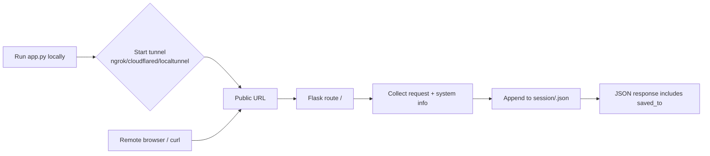

# Tunnel Session Capture

Python toolkit to **capture incoming HTTP request details + basic system/environment metadata** through a Flask endpoint exposed via a tunnel (ngrok / cloudflared / localtunnel).

Captured sessions are saved as JSON under `./session/`.

> ⚠️ Ethics / Safety
> Use only on traffic/systems you own or where you have explicit permission. Session logs may contain sensitive metadata.

## How it works (diagram)



## Project structure

- `app.py` - Flask capture server + tunnel bootstrap
- `main.py` - interactive menu (list sessions / start capture)
- `helper/systemInfo.py` - request + environment metadata collection
- `helper/session.py` - session persistence helpers (writes to `session/*.json`)
- `session/` - stored session JSON files (gitignored)

## Requirements

- Python 3.10+
- Recommended: virtualenv

Python packages:
- `flask`
- `pyngrok` (if you use ngrok)
- `requests`

Tunnel provider prerequisites:
- **ngrok**: account/auth token may be required
- **cloudflared**: install `cloudflared` and ensure it is in `PATH`
- **localtunnel**: `npm i -g localtunnel` (command `lt` must be in `PATH`)

## Setup

```bash
python -m venv .venv

# PowerShell
. .\.venv\Scripts\Activate.ps1

# Git Bash
source .venv/Scripts/activate

pip install flask pyngrok requests
```

## Usage

### 1) Start the capture server (app.py)

```bash
python app.py --tunnel ngrok
# or: cloudflared / localtunnel
python app.py --tunnel cloudflared
python app.py --tunnel localtunnel
```

It prints a **Public URL**. Open it in a browser.

When someone hits `/`, a session entry is appended to `session/<client_ip>.json` and the server exits after capturing the request.

### 2) View/list captured sessions (main.py)

```bash
python main.py
```

Select:
- `1` to list available session JSON files and pick one.
- `3` to start the capture server (calls `app.py`).

## Example session JSON

Each `session/<ip>.json` file is a list. Example (trimmed):

```json
[
  {
    "ip": "203.0.113.10",
    "local_ip": "192.168.1.7",
    "timestamp": "2026-02-15T00:03:11",
    "client_user_agent": "Mozilla/5.0 ...",
    "request_method": "GET",
    "request_path": "/",
    "server_hostname": "DESKTOP-PML7EU0",
    "server_os": "Windows"
  }
]
```

## Git hygiene

This repo includes a `.gitignore` so your local sessions and venv are not committed.

## License

Add a license before sharing publicly (MIT is a common default).